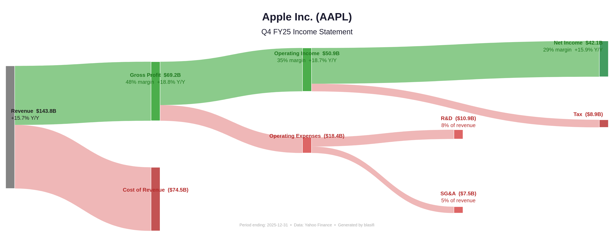

# blasifi

US stock quarterly income statement visualizer — fetches the latest earnings data, generates a Sankey diagram, and downloads SEC filings (10-Q / 10-K) automatically.



## How It Works

Enter a US stock ticker → the tool pulls the latest quarterly income statement from Yahoo Finance, fetches revenue segment breakdown from SEC EDGAR, and outputs an interactive Sankey chart showing how revenue flows through costs and profits.

The chart reads **left → right**:
- **Green (top)**: profit stream — Revenue → Gross Profit → Operating Income → Net Income
- **Red (bottom)**: cost branches — Cost of Revenue, Operating Expenses (R&D, SG&A, Amortization), Tax

At each stage, subtract the red flowing downward from the green to get the next level of profit.

## Quick Start

```bash
git clone https://github.com/your-username/blasifi.git
cd blasifi
python3 -m venv .venv
.venv/bin/pip install -r requirements.txt

# For PNG export (optional, requires Chrome)
.venv/bin/plotly_get_chrome
```

## Usage

```bash
./blasifi NVDA        # direct mode
./blasifi AMD
./blasifi AAPL
./blasifi             # interactive mode — prompts for ticker
```

### Output

All files are saved to `./stocks/{SYMBOL}/`:

```
stocks/AAPL/
├── AAPL_FY25Q4_Income.html    # Interactive Sankey chart (open in browser)
├── AAPL_FY25Q4_Income.png     # Static image
├── AAPL_FY25Q4_10-Q.html      # SEC 10-Q filing
└── AAPL_FY25Q4_10-K.html      # SEC 10-K filing
```

## Example

```
============================================================
  Apple Inc. (AAPL)
  Q4 FY25 Income Statement
  Period ending: 2025-12-31
============================================================
  Revenue:                 $143.8B
  Cost of Revenue:          $74.5B
  Gross Profit:             $69.2B  (48% margin)
  ─────────────────────────────────
  R&D:                      $10.9B
  SG&A:                      $7.5B
  Operating Income:         $50.9B  (35% margin)
  ─────────────────────────────────
  Tax:                       $8.9B
  Net Income:               $42.1B  (29% margin)
============================================================
  Y/Y Changes:
    Revenue                   +15.7%
    Gross Profit              +18.8%
    Operating Income          +18.7%
    Net Income                +15.9%

=======================================================
  Apple Inc. — Revenue Breakdown
  Q ending Dec. 27, 2025  (10-Q)
=======================================================
  Total Revenue:                 $143.8B
  ---------------------------------------------
  iPhone                           $85.3B  (59%)
  Services                         $30.0B  (21%)
  Wearables, Home and Accessories   $11.5B  (8%)
  iPad                              $8.6B  (6%)
  Mac                               $8.4B  (6%)
```

## Project Structure

| File | Description |
|------|-------------|
| `blasifi` | Shell wrapper — runs `main.py` with the venv Python, no activation needed |
| `main.py` | Entry point — CLI argument or interactive mode |
| `user_input.py` | User interaction — ticker input and validation |
| `finance_data.py` | Data fetching — yfinance API, quarterly income statement parsing |
| `segment_data.py` | Revenue breakdown — SEC EDGAR API, XBRL report parsing |
| `visualizer.py` | Visualization — Plotly Sankey diagram with profit/cost layout |
| `requirements.txt` | Python dependencies |

## Dependencies

- [yfinance](https://github.com/ranaroussi/yfinance) — free Yahoo Finance API
- [Plotly](https://plotly.com/python/) — interactive charting
- [Kaleido](https://github.com/nicholasgasior/kaleido) — static PNG export (optional)

## License

MIT
