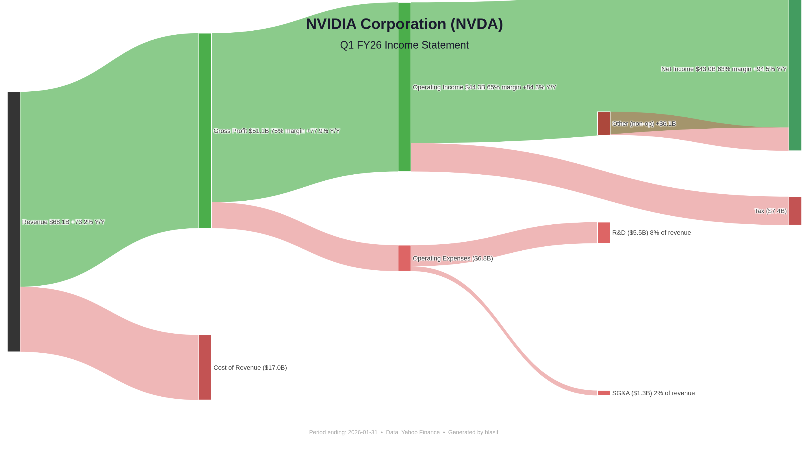

# blasifi

US stock quarterly income statement visualizer — automatically fetches the latest earnings data and generates a Sankey diagram.



## How It Works

Enter a US stock ticker → the tool pulls the latest quarterly income statement from Yahoo Finance → outputs an interactive Sankey chart showing how revenue flows through costs and profits.

The chart reads **left → right**:
- **Green (top)**: profit stream — Revenue → Gross Profit → Operating Income → Net Income
- **Red (bottom)**: cost branches — Cost of Revenue, Operating Expenses (R&D, SG&A, Amortization), Tax, etc.

At each stage, subtract the red flowing downward from the green to get the next level of profit.

## Quick Start

```bash
git clone https://github.com/your-username/blasifi.git
cd blasifi
python3 -m venv .venv
.venv/bin/pip install -r requirements.txt

# For PNG export (optional, requires Chrome)
.venv/bin/plotly_get_chrome
```

## Usage

```bash
./blasifi NVDA        # direct mode
./blasifi AMD
./blasifi AAPL
./blasifi             # interactive mode — prompts for ticker
```

### Output

Each run generates:
- **`.html`** — interactive chart (opens in browser, hover for details)
- **`.png`** — static image (requires Chrome, installed via `plotly_get_chrome`)

Example output filenames: `NVDA_q1_fy26_income.html`, `NVDA_q1_fy26_income.png`

## Example

```
============================================================
  NVIDIA Corporation (NVDA)
  Q1 FY26 Income Statement
  Period ending: 2026-01-31
============================================================
  Revenue:                  $68.1B
  Cost of Revenue:          $17.0B
  Gross Profit:             $51.1B  (75% margin)
  ─────────────────────────────────
  R&D:                       $5.5B
  SG&A:                      $1.3B
  Operating Income:         $44.3B  (65% margin)
  ─────────────────────────────────
  Other (non-op):    +     $6.1B
  Pretax Income:            $50.4B
  Tax:                       $7.4B
  Net Income:               $43.0B  (63% margin)
============================================================
  Y/Y Changes:
    Revenue                   +73.2%
    Gross Profit              +77.9%
    Operating Income          +84.3%
    Net Income                +94.5%
```

## Project Structure

| File | Description |
|------|-------------|
| `blasifi` | Shell wrapper — runs `main.py` with the venv Python, no activation needed |
| `main.py` | Entry point — CLI argument or interactive mode |
| `user_input.py` | User interaction — ticker input and validation |
| `finance_data.py` | Data fetching — yfinance API, quarterly income statement parsing |
| `visualizer.py` | Visualization — Plotly Sankey diagram with profit/cost layout |
| `requirements.txt` | Python dependencies |

## Dependencies

- [yfinance](https://github.com/ranaroussi/yfinance) — free Yahoo Finance API
- [Plotly](https://plotly.com/python/) — interactive charting
- [Kaleido](https://github.com/nicholasgasior/kaleido) — static PNG export (optional)

## License

MIT
